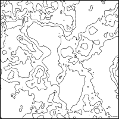
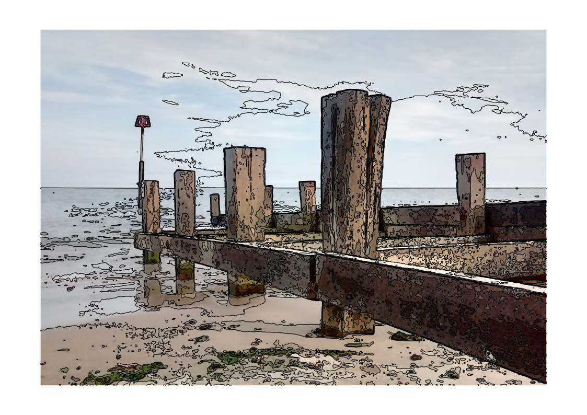

# HaggisContours

A method of converting a heightmap (or similar input) to a set of contours, using the wild haggis algorithm.

This is a Go programme for extacting contours from a [heightmap](https://en.wikipedia.org/wiki/Heightmap), or from a similar data source such as an image.

It uses a simple algorithm, based on the behaviour of wild haggis on the mountains of Scotland.  As is [well known](https://www.thehaggis.com/wild-haggis-all-about-haggis/),
dextrous wild haggis have their left legs longer than their right legs, which makes it easy for them to run clockwise
around hillsides to escape predators.  Obviously the opposite applies to the sinistrous sub-species, which don't.

The code provided here takes an image file (PNG, JPEG, or GIF) as input, and converts each pixel to a value between 0 (black) and 255 (white).  Threshold values
for contours can have any value from 0 to 255.  Output is in the form of a simple SVG file.

## Status

The algorithm came to me while working on a version of [Ben Foxall's Moore-Neighbourhood contour finder](https://github.com/benfoxall/contours).

In fact an important part of the method -- using an array of 'seen' flags to avoid reworking contours that have
been found already -- comes straight from Foxall's code.

## Usage

    $ hcontours thingy.png

will create a file called thingy-hc-t128m15pA4L.svg.  The numbers in the output SVG file name indicate
the values used for the threshold, margin, and paper options -- in this case, the default values.

## Details

Contours at each level are grouped into Inkscape/Axidraw-style layers with the threshold as label.  The frame is in layer 0.

### Options

* `--threshold | -t <value[,...]>`
Specify one or more threshold values, separated by commas, each in the range 0..255.  These are the pixel
values that are used to find the contours.  If used, this option overrides --tcount.  Default `128`. Examples: `-t 99` `--threshold 32,64,96,128,160,192,224`

* `--tcount | -T <1..254>`
Set the number of evenly-spaced threshold values.  For example, `-T 3` is equivalent to `-t 64,128,192`.  This option is ignored if `--threshold` is also specified.
Valid range is 1 to 254.  Default `1`.  Examples: `--tcount 7` `-T8`

* `--linewidth`
The line width used for drawing contours, in millimetres.  Default `0.5`.  Examples: `--linewidth 1`, `--linewidth 2.54`

* `--margin | -m <width>`
Define the minimum width of the margin around the created image.  
The value is interpreted as millimetres if greater than 2, otherwise as inches.
Default 15 (mm).  Examples: `-m 10` (mm) `--margin 1.5` (inches)

* `--paper | -p <papersize>`
Choose the paper size to use, either one of the pre-defined sizes (A4L, A4P, A3L, or A3P),
or a custom size in the format `<width>x<height>`.  Width and height are interpreted as millimetres
if the value is greater than 30, otherwise as inches.  
Default A4L. Examples: `-p A3L` `--paper 200x300` (mm) `-p 7x5` (inches)

* `--frame | -f`
Draw a simple frame around the SVG image.  Default false. Example `-f`

* `--framewidth`
The line width used for drawing the frame, in millimetres.  Default `1.0`.  Examples: `--framewidth 3`, `--framewidth 0.8`

* `--image | -i`
Use the original image as a background in the SVG image.  Default false. Example: `--image`

* `--clip | -c`
Clip borders of image, rather than breaking contours.  This will hopefully allow filling contours, but won't work with AxiDraw. Default false.

* `--dev | -d`
Add extra bits to the SVG -- intended for developer use only.  Default false.

## Examples

`hcontours examples/Heightmap.png -t 64,128,192 --paper 200x200 --margin 0 --frame` produces this:

&nbsp;&nbsp;&nbsp;&nbsp;

`hcontours examples/beach.png -t 32,64,96,128,160,192,224 --paper A4L --image --linewidth 0.3` produces this:

&nbsp;&nbsp;&nbsp;&nbsp;

